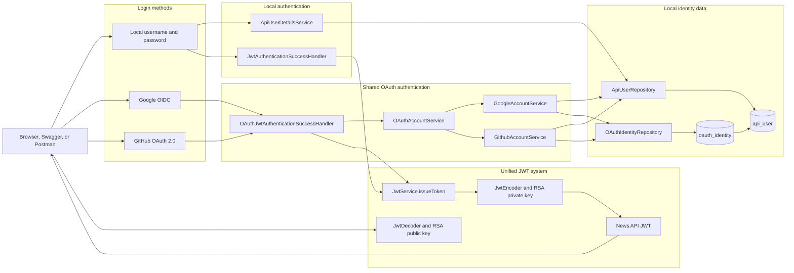
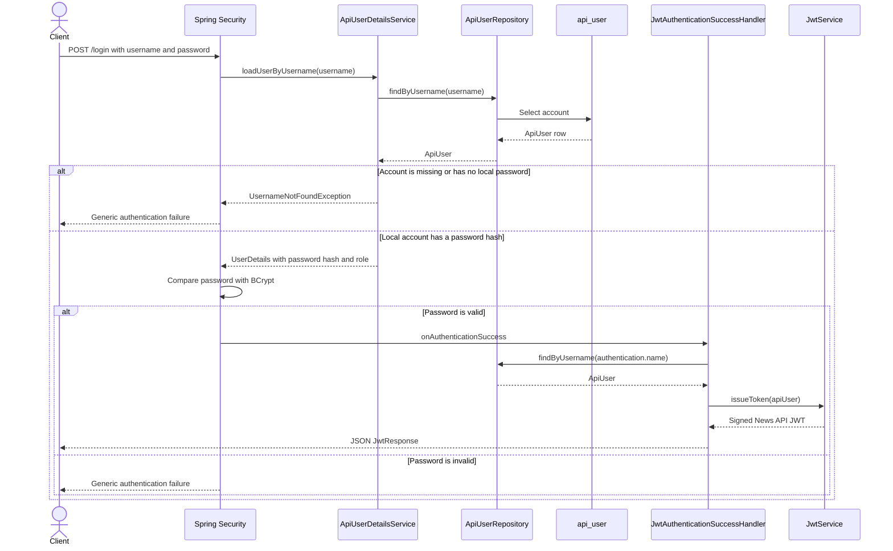
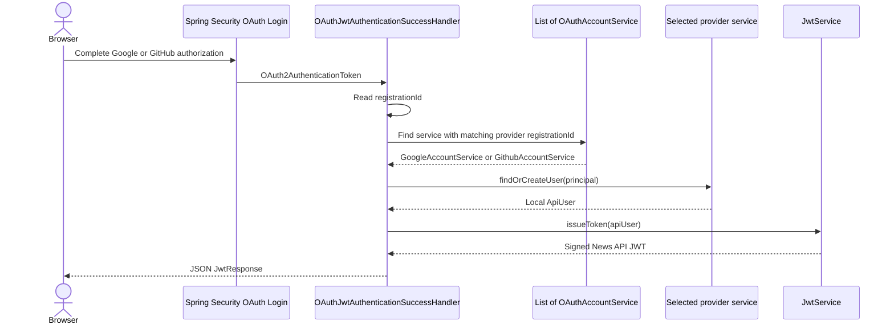
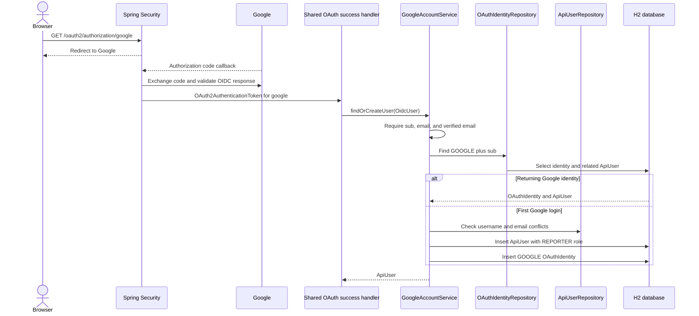
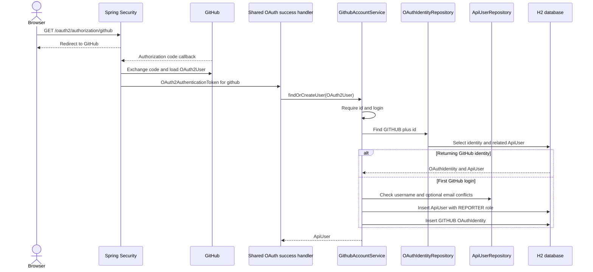
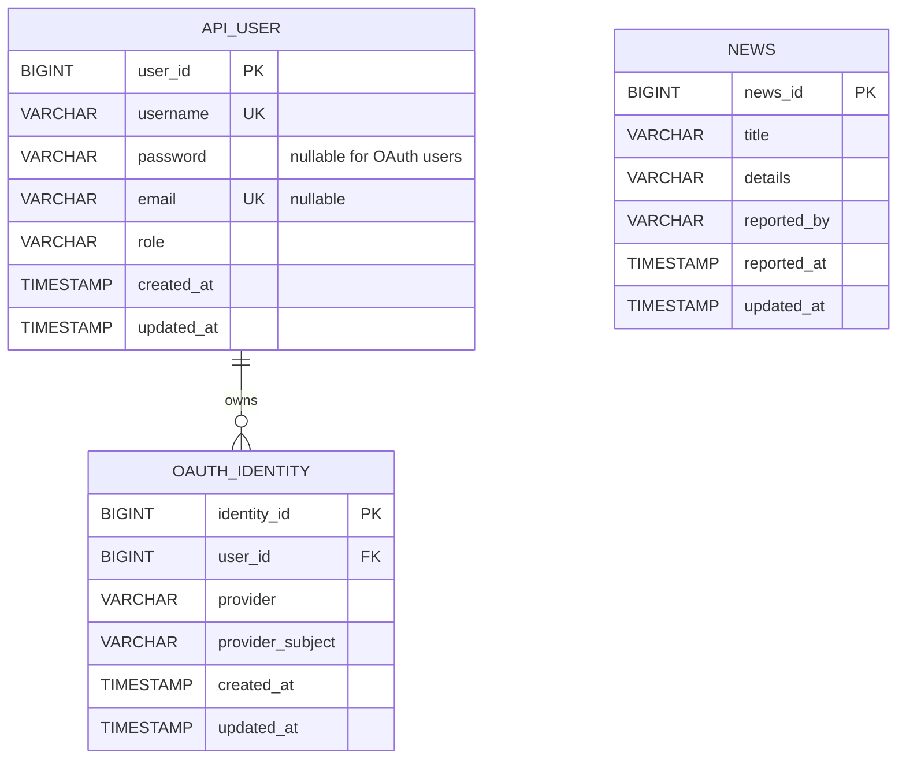
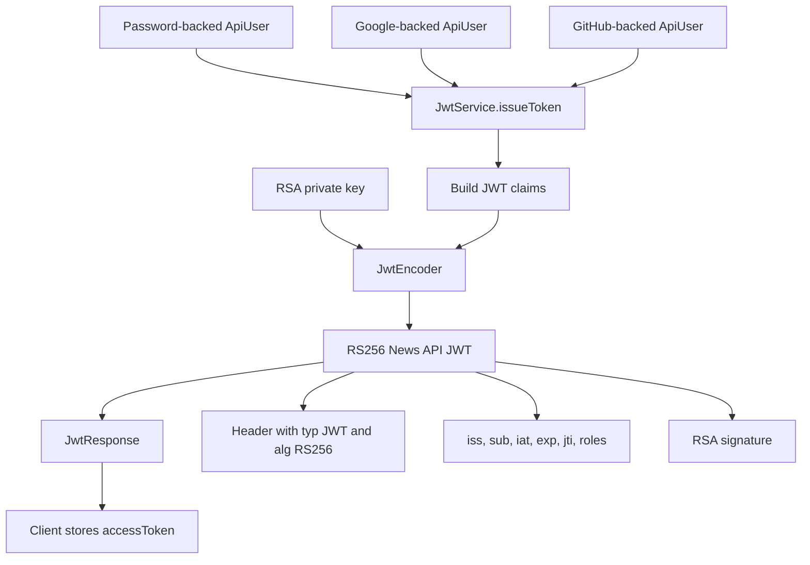
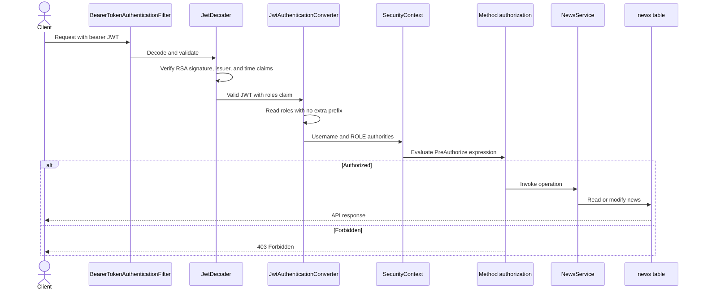

# News API Authentication Architecture

This document describes the authentication and authorization code currently in
the News API. The application supports three login paths:

1. Local username and password authentication.
2. Google OpenID Connect login.
3. GitHub OAuth 2.0 login.

Every successful login resolves to a local `ApiUser` and issues the same News
API JWT. Protected endpoints therefore do not need to know how the user logged
in.

## Complete Architecture



Google and GitHub prove an external identity, but their access tokens are not
accepted by the News API. The application creates its own local JWT after the
external identity has been associated with an `ApiUser`.

## Package Responsibilities

```text
security
|-- SecurityConfig.java
|-- OpenApiConfig.java
|-- api_user
|   |-- ApiUser.java
|   |-- ApiUserDetailsService.java
|   |-- ApiUserRepository.java
|   `-- Role.java
|-- jwt
|   |-- JwtAuthenticationSuccessHandler.java
|   |-- JwtKeyConfig.java
|   |-- JwtResponse.java
|   |-- JwtService.java
|   `-- JwtTokenSettings.java
|-- oauth
|   |-- OAuthAccountService.java
|   |-- OAuthIdentity.java
|   |-- OAuthIdentityRepository.java
|   |-- OAuthJwtAuthenticationSuccessHandler.java
|   |-- OAuthProvider.java
|   |-- google
|   |   `-- GoogleAccountService.java
|   `-- github
|       `-- GithubAccountService.java
```

- Root configuration selects the authentication mechanisms and URL rules.
- `api_user` owns local accounts, roles, and password-based user loading.
- `jwt` owns RSA key loading, JWT issuance, validation, and the local-login
  response.
- `oauth` owns the provider contract, external identity persistence, provider
  selection, the shared OAuth success response, and provider subpackages.
- `oauth.google` and `oauth.github` understand provider-specific attributes and
  provision local accounts.

## Application Startup

At startup:

1. `application.yaml` reads `JWT_PRIVATE_KEY`, `JWT_PUBLIC_KEY`,
   `GOOGLE_CLIENT_ID`, `GOOGLE_CLIENT_SECRET`, `GITHUB_CLIENT_ID`, and
   `GITHUB_CLIENT_SECRET` from the environment.
2. Liquibase creates and seeds `news` and `api_user`, then creates
   `oauth_identity`, adds nullable unique email support, and permits null
   passwords for OAuth-only users.
3. Hibernate runs with `ddl-auto: validate`, so it validates the Liquibase
   schema instead of creating it.
4. `JwtKeyConfig.jwtKeyPair(...)` Base64-decodes the PKCS#8 private key and
   X.509 public key.
5. `JwtKeyConfig.jwtEncoder(...)` creates the RS256 token encoder.
6. `JwtKeyConfig.jwtDecoder(...)` creates the decoder and requires issuer
   `news-api`.
7. `SecurityConfig.securityFilterChain(...)` enables form login, OAuth login,
   JWT resource-server authentication, URL authorization, and stateless API
   security.

## Local Login



`ApiUserDetailsService.loadUserByUsername(...)` calls
`.roles(user.getRole().name())`. Spring converts `ADMIN`, `EDITOR`, or
`REPORTER` into `ROLE_ADMIN`, `ROLE_EDITOR`, or `ROLE_REPORTER`.

OAuth-only accounts have no local password. The service rejects those accounts
with the same generic `UsernameNotFoundException` used for an unknown username,
so form login neither accepts them nor reveals which kind of account exists.
Their Google or GitHub login flow is unaffected.

The local success handler reloads the complete `ApiUser`, issues a JWT, and
writes it directly as JSON instead of redirecting to another page.

## Shared OAuth Login

Spring sends both provider callbacks through the one handler configured by:

```text
SecurityConfig.oauth2Login(...)
    -> OAuthJwtAuthenticationSuccessHandler
```



`OAuthAccountService` is the provider strategy contract. Each implementation:

- reports its `OAuthProvider`;
- accepts Spring's common `OAuth2User` type;
- validates and reads its own provider attributes;
- returns a local `ApiUser`.

`OAuthProvider` stores both the database enum value and Spring registration ID:

| Enum value | Registration ID |
| --- | --- |
| `GOOGLE` | `google` |
| `GITHUB` | `github` |

The common handler compares the callback registration ID with
`OAuthProvider.registrationId`. Adding another provider requires another enum
value, client registration, and `OAuthAccountService` implementation; it does
not require another success handler.

## Google Login



Google-specific behavior:

- The principal must be an `OidcUser`.
- `sub` is the stable provider subject.
- Email must be present and `email_verified` must be true.
- Email is normalized to lowercase and becomes both local email and username.
- A first-time account receives `REPORTER` and has a null password.
- Existing username or email produces an account-conflict exception rather
  than silently linking accounts.

## GitHub Login



GitHub-specific behavior:

- The numeric `id` attribute is converted to text and used as the stable
  provider subject.
- `login` is required and normalized to lowercase.
- The local username is `github:<login>`, which avoids collision with ordinary
  local usernames.
- Email is optional because GitHub can omit private email addresses from the
  standard user response.
- If email is present, it is normalized and checked for conflicts.
- A first-time account receives `REPORTER` and has a null password.

## Identity Provisioning and Linking

Both provider services run in a transaction. On first login they save:

1. One `ApiUser`.
2. One `OAuthIdentity` pointing to that user.

If the second insert fails, the first insert rolls back. Returning login looks
up `(provider, providerSubject)` first and reuses the related user.

`OAuthIdentity.apiUser` remains lazily mapped by default. For the returning
login query, `OAuthIdentityRepository.findByProviderAndProviderSubject(...)`
uses `@EntityGraph(attributePaths = "apiUser")` to load the related `ApiUser`
with the identity. This ensures that `JwtService` can read the username and
role after the provider service transaction has ended, without causing a
`LazyInitializationException`.

Automatic account linking is intentionally not implemented. If a new provider
identity has an email or username already used by another local account, login
is rejected. Matching an email alone is not treated as proof that two external
identities should control the same local account.

A future explicit linking flow should begin while the user is already
authenticated, complete the second provider's OAuth flow, and attach only the
new `OAuthIdentity` to the existing `ApiUser`.

## Database Model



Liquibase enforces:

- unique `api_user.username`;
- unique non-null `api_user.email`;
- foreign key from `oauth_identity.user_id` to `api_user.user_id` with delete
  cascade;
- unique `(provider, provider_subject)` so an external account is stored once;
- unique `(user_id, provider)` so one local user has at most one identity from
  each provider.

There is no foreign key between `news.reported_by` and `api_user.username`.
News ownership is a logical string relationship.

## Unified JWT

All login paths converge on:

```text
JwtService.issueToken(ApiUser apiUser)
```



The JWT contains:

| Claim | Meaning |
| --- | --- |
| `iss` | Fixed issuer `news-api` |
| `sub` | Local `ApiUser.username` |
| `iat` | Issuance time |
| `exp` | Expiration, 60 minutes after issuance |
| `jti` | Random UUID token identifier |
| `roles` | List such as `ROLE_REPORTER` |

The response shape is:

```json
{
  "accessToken": "<signed-jwt>",
  "tokenType": "Bearer",
  "expiresIn": 3600
}
```

The private RSA key signs tokens. The public RSA key verifies them. Google and
GitHub tokens cannot replace this JWT because the resource server expects the
News API signature and issuer.

## Bearer Request and Authorization

Protected requests send:

```http
Authorization: Bearer <accessToken>
```



`SecurityConfig.jwtAuthenticationConverter()` reads the `roles` claim and sets
an empty authority prefix because the values already include `ROLE_`.

URL-level rules currently make these paths public:

- `/swagger-ui/**`
- `/swagger-ui.html`
- `/v3/api-docs/**`
- `GET /api/v1/news`
- `GET /api/v1/news/**`

Every other path requires authentication. Method security then enforces:

| Operation | ADMIN | EDITOR | REPORTER | Anonymous |
| --- | --- | --- | --- | --- |
| List news | Yes | Yes | Yes | Yes |
| Get news by ID | Yes | Yes | Yes | Yes |
| Create news | Yes | Yes | Yes | No |
| Update news | Yes | Yes | Own news only | No |
| Delete news | Yes | Yes | Own news only | No |

For ownership, `NewsAuthorization.isOwner(...)` checks whether `news.reported_by`
equals `authentication.name`. `NewsService.createNews(...)` writes that same
authenticated name into `reportedBy`:

- local reporter example: `reporter1`;
- Google reporter example: normalized Google email;
- GitHub reporter example: `github:<login>`.

## Session and CSRF Behavior

The API security context is stateless and protected API requests authenticate
with bearer tokens. CSRF is disabled in the current filter chain.

OAuth login still needs temporary state between the initial provider redirect
and `/login/oauth2/code/{registrationId}`. Spring may use an HTTP session for
that authorization-request state even though the resulting API authentication
uses a stateless JWT. That temporary OAuth state is not the API login session.

## Development Database

The application uses `jdbc:h2:mem:newsdb`, so all data is lost when the
application process ends. The H2 console is enabled in `application.yaml` at
`/h2-console`.

The current `SecurityConfig` does not permit the H2 console path or relax frame
headers for it, so the browser console is not currently usable through the
secured application. Development-only console access requires a dedicated H2
security rule or filter chain. It should not be exposed in production.

## Current Review Notes

The intended package boundaries and main authentication flows are coherent and
the project compiles. The following limitations remain:

1. H2 console access is enabled in configuration but not permitted by the
   current security filter chain.
2. Existing endpoint tests predate JWT authentication and authorization. They
   need authenticated JWT identities plus role and ownership coverage.
3. JWTs are not stored or revoked. Logout means deleting the token client-side;
   a copied token remains valid until expiration.
4. Changing a role in the database does not alter an already-issued JWT. The
   new role takes effect after another token is issued.
5. Provider account creation performs check-then-insert operations. Database
   unique constraints preserve integrity during concurrent first logins, but a
   resulting constraint violation is not translated into a provider-friendly
   authentication response.
6. Account linking is not implemented. A second provider with an existing
   username or email is rejected rather than attached automatically.
7. Security and Liquibase DEBUG logging, the H2 console, and full actuator
   exposure are development settings and should be restricted in production.
