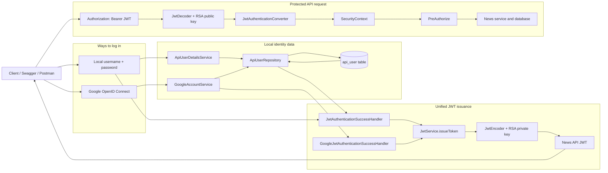
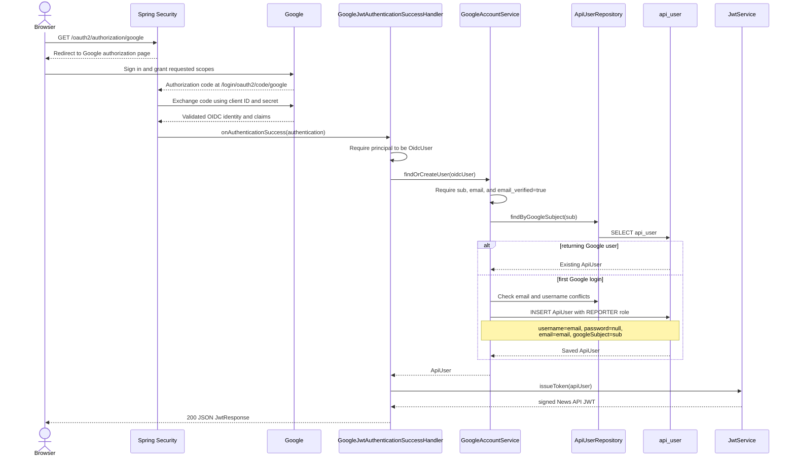
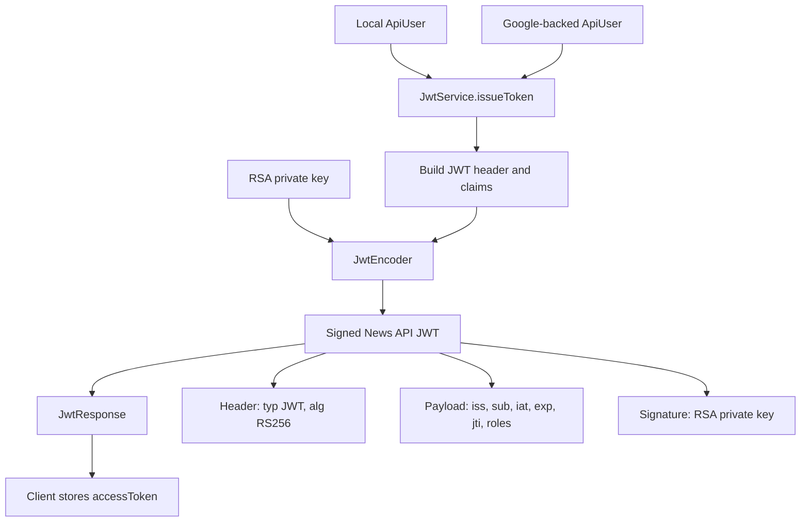
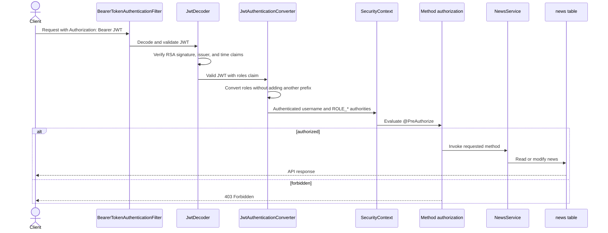
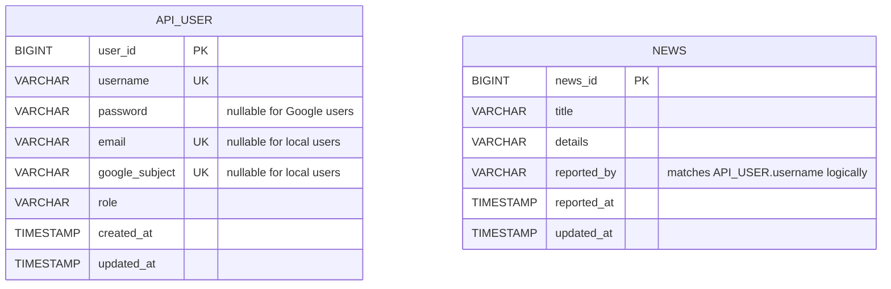

# News API Authentication Flow

This document describes the authentication and authorization implementation in
the News API. The application supports two ways to prove identity:

1. Local username and password login.
2. Google OpenID Connect login.

Both login methods finish by issuing the same News API JWT. Protected API
requests therefore work identically after either type of login.

## Complete Architecture



The important design decision is that Google does **not** issue the token used
to call this API. Google proves the user's identity, then this application
loads or creates a local `ApiUser` and issues its own JWT.

## Application Startup

Before any login occurs, Spring creates the security components:

1. `application.yaml` reads the RSA keys from `JWT_PRIVATE_KEY` and
   `JWT_PUBLIC_KEY`. It also reads `GOOGLE_CLIENT_ID` and
   `GOOGLE_CLIENT_SECRET`.
2. `JwtKeyConfig.jwtKeyPair(...)` Base64-decodes the configured RSA keys.
3. `JwtKeyConfig.jwtEncoder(...)` creates an encoder with the private and
   public keys. The private key signs new JWTs.
4. `JwtKeyConfig.jwtDecoder(...)` creates a decoder with the public key. It
   verifies JWT signatures and requires the issuer to be `news-api`.
5. `SecurityConfig.securityFilterChain(...)` configures local form login,
   Google OAuth login, JWT resource-server authentication, URL rules, and
   stateless API security.
6. Liquibase creates and seeds `api_user`; the Google identity migration adds
   `email` and `google_subject` and permits a null password for Google-only
   users. Hibernate uses `ddl-auto: validate`, so it checks rather than creates
   the schema.

## Local Login Flow

```mermaid
sequenceDiagram
    actor Client
    participant Security as Spring Security
    participant Details as ApiUserDetailsService
    participant Repo as ApiUserRepository
    participant DB as api_user
    participant Handler as JwtAuthenticationSuccessHandler
    participant JWT as JwtService

    Client->>Security: POST /login with username and password
    Security->>Details: loadUserByUsername(username)
    Details->>Repo: findByUsername(username)
    Repo->>DB: SELECT api_user
    DB-->>Repo: local user
    Repo-->>Details: ApiUser
    Details-->>Security: UserDetails with password hash and role
    Security->>Security: BCrypt password comparison
    alt credentials are valid
        Security->>Handler: onAuthenticationSuccess(...)
        Handler->>Repo: findByUsername(authentication.name)
        Repo-->>Handler: ApiUser
        Handler->>JWT: issueToken(apiUser)
        JWT-->>Handler: signed News API JWT
        Handler-->>Client: 200 JSON JwtResponse
    else credentials are invalid
        Security-->>Client: authentication failure
    end
```

### Files and functions

- `SecurityConfig.formLogin(...)` enables the local `/login` flow and registers
  `JwtAuthenticationSuccessHandler`.
- `ApiUserDetailsService.loadUserByUsername(...)` finds the local account and
  converts its role into Spring Security authorities. Calling
  `.roles("ADMIN")` produces the authority `ROLE_ADMIN`.
- `BCryptPasswordEncoder` compares the submitted password with the stored hash.
- `JwtAuthenticationSuccessHandler.onAuthenticationSuccess(...)` reloads the
  complete `ApiUser`, calls `JwtService.issueToken(...)`, and writes a
  `JwtResponse` as JSON.

The seeded `admin`, `editor`, and reporter accounts use this flow. Google-only
accounts have a null password and are not intended to use local password login.

## Google Login Flow



### Why `google_subject` is used

Google's `sub` claim is the stable identifier for the Google account. The code
stores it as `google_subject` and uses
`ApiUserRepository.findByGoogleSubject(...)` for returning logins. Email is
normalized to lowercase and used as the initial local username, but it is not
the primary Google identity key.

### First and returning login behavior

- First login: `GoogleAccountService.findOrCreateUser(...)` creates a local
  user with the `REPORTER` role.
- Returning login: the existing local user is returned, including any role
  currently stored in the database.
- Invalid identity: missing `sub`, missing email, or an unverified email causes
  an OAuth authentication exception.
- Account conflict: an existing local username or email prevents automatic
  linking. The application does not silently merge accounts.

Google login temporarily needs state between the initial redirect and the
callback so Spring can validate the OAuth request. This authorization-flow
state is separate from API authentication. After login, protected API requests
use the JWT and do not rely on that session.

## Unified JWT

Both success handlers call exactly the same function:

```text
JwtService.issueToken(ApiUser apiUser)
```



The JWT contains:

| Field | Meaning |
| --- | --- |
| `iss` | Token issuer, fixed to `news-api` |
| `sub` | Local `ApiUser.username` |
| `iat` | Time the token was issued |
| `exp` | Expiration time, 60 minutes after issuance |
| `jti` | Random unique token identifier |
| `roles` | List containing a value such as `ROLE_REPORTER` |

`JwtResponse` returns:

```json
{
  "accessToken": "<signed-jwt>",
  "tokenType": "Bearer",
  "expiresIn": 3600
}
```

The private RSA key is required only to issue tokens. The public RSA key is
enough to verify their signatures. A Google token is not interchangeable with
this token because the API expects this application's signature and issuer.

## Authenticated API Request Flow

After either login, the client sends the returned token on protected requests:

```http
Authorization: Bearer <accessToken>
```



`SecurityConfig.jwtAuthenticationConverter()` reads authorities from the
`roles` claim and sets an empty authority prefix. This is necessary because the
JWT already contains `ROLE_ADMIN`, `ROLE_EDITOR`, or `ROLE_REPORTER`; adding
Spring's default prefix would incorrectly produce `SCOPE_ROLE_REPORTER`.

## URL and Role Rules

The filter chain first applies URL-level rules:

- Swagger and OpenAPI paths are public.
- `GET /api/v1/news` and `GET /api/v1/news/{newsId}` are public.
- Every other request must be authenticated.
- CSRF is disabled because protected API requests use bearer tokens rather
  than browser cookies for authentication.
- `SessionCreationPolicy.STATELESS` prevents the API security context from
  being persisted as a login session.

`@EnableMethodSecurity` activates the detailed rules on `NewsService`:

| Operation | ADMIN | EDITOR | REPORTER | Public |
| --- | --- | --- | --- | --- |
| List news | Yes | Yes | Yes | Yes |
| Get news by ID | Yes | Yes | Yes | Yes |
| Create news | Yes | Yes | Yes | No |
| Update news | Yes | Yes | Own news only | No |
| Delete news | Yes | Yes | Own news only | No |

For reporter ownership, `NewsAuthorization.isOwner(newsId, username)` calls
`NewsRepository.existsByNewsIdAndReportedBy(...)`. The username comes from the
JWT subject through `authentication.name`.

When creating news, `NewsService.createNews(...)` also reads that authenticated
name from the `SecurityContext` and stores it in `News.reportedBy`. Therefore:

- a local reporter's news is owned by a username such as `reporter1`;
- a Google reporter's news is owned by the normalized Google email used as the
  local username.

## Database Role



There is currently no database foreign key between `news.reported_by` and
`api_user.username`. Ownership is a logical relationship checked by matching
their string values.

## File Map

| File | Responsibility |
| --- | --- |
| `SecurityConfig` | Security filter chain, public routes, login mechanisms, JWT role conversion |
| `ApiUser` | Local representation of both password and Google users |
| `ApiUserDetailsService` | Loads password-based users for local authentication |
| `ApiUserRepository` | Queries users by username or Google subject and detects conflicts |
| `GoogleAccountService` | Validates Google claims and finds or provisions a local reporter |
| `GoogleJwtAuthenticationSuccessHandler` | Converts successful Google login into a local JWT response |
| `JwtAuthenticationSuccessHandler` | Converts successful password login into a local JWT response |
| `JwtService` | Builds and signs the shared News API JWT |
| `JwtKeyConfig` | Loads RSA keys and creates the JWT encoder and decoder |
| `JwtTokenSettings` | Defines issuer and token lifetime |
| `JwtResponse` | Defines the JSON returned after successful login |
| `NewsService` | Applies role and ownership authorization to CRUD operations |
| `NewsAuthorization` | Checks reporter ownership against the news table |
| `OpenApiConfig` | Describes JWT bearer authentication to Swagger UI |

## Security Boundaries

The following checks happen at different layers:

1. Google validates the Google credentials and returns an OIDC identity.
2. Spring Security validates the OAuth callback and Google's OIDC response.
3. `GoogleAccountService` validates the required Google identity claims.
4. `JwtService` signs a News API token using the private RSA key.
5. `JwtDecoder` validates the signature, issuer, and lifetime on every bearer
   request.
6. URL authorization requires authentication for non-public endpoints.
7. `@PreAuthorize` enforces role and reporter-ownership rules.

JWT authentication is stateless: the token itself carries the username and
role until it expires. Changing a user's role in the database does not change
an already-issued JWT; the new role takes effect when a new token is issued.

## Current Implementation Notes

- JWTs are not stored in the database and there is no revocation list. Logout
  means deleting the token on the client; an issued token otherwise remains
  valid until its 60-minute expiration.
- `ApiUserDetailsService` currently passes the database password directly to
  Spring's `User` builder. It should explicitly reject accounts whose password
  is null so a Google-only account cannot enter the password-login path.
- Security DEBUG logging is useful while diagnosing OAuth, but it should be
  reduced outside development because authentication logs can expose sensitive
  request details.
- Automated authentication and authorization tests are still marked as TODO in
  the project.
